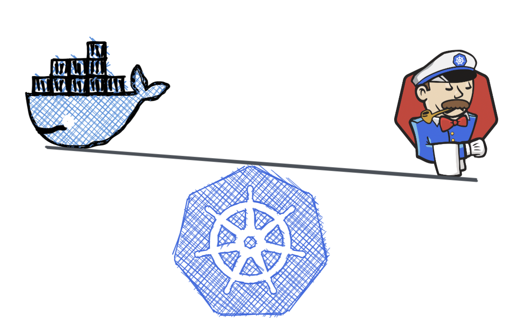
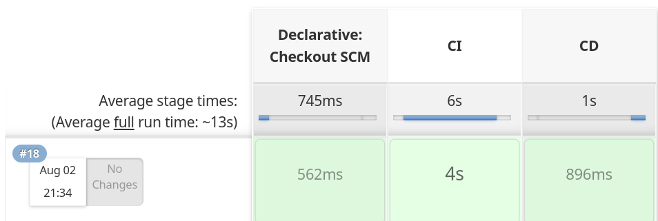
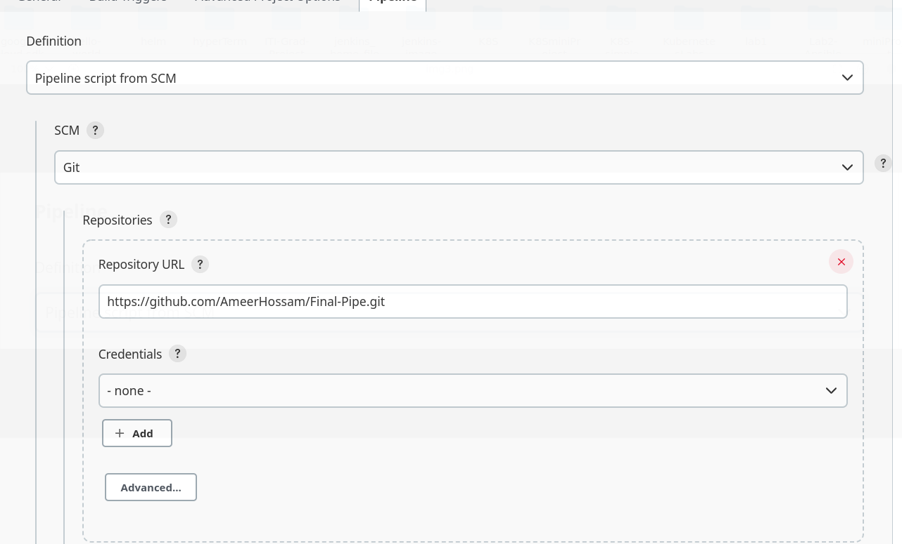

### Building Docker image  for a Python-Redis app and deploy the app on GKE cluster using CI/CD

- #### 1) Make an Image for the application , check the Docker file in this link [Dockerfile]( https://github.com/AmeerHossam/Final-Pipe/blob/master/python-Code/Dockerfile ).

- #### 2) Make a deployment for the application using the image we did by pulling it from DockerHub , check the deployment yaml file [Deployment File](https://github.com/AmeerHossam/Final-Pipe/blob/master/depl-files/deploy.yaml).
- #### 3) Make a load balancer service for the deployment to access the pod from using external IP, check the service yaml file [Service File](https://github.com/AmeerHossam/Final-Pipe/blob/master/depl-files/services.yaml).
- #### 4) Make a Jenkinsfile to automate CI/CD processes , check the pipeline  in this link [Pipeline](https://github.com/AmeerHossam/Final-Pipe/blob/master/jenkinsfile).

### Steps for running the pipeline on jenkins
- #### I used pipeline script from SCM

- #### Then give it the github repository

